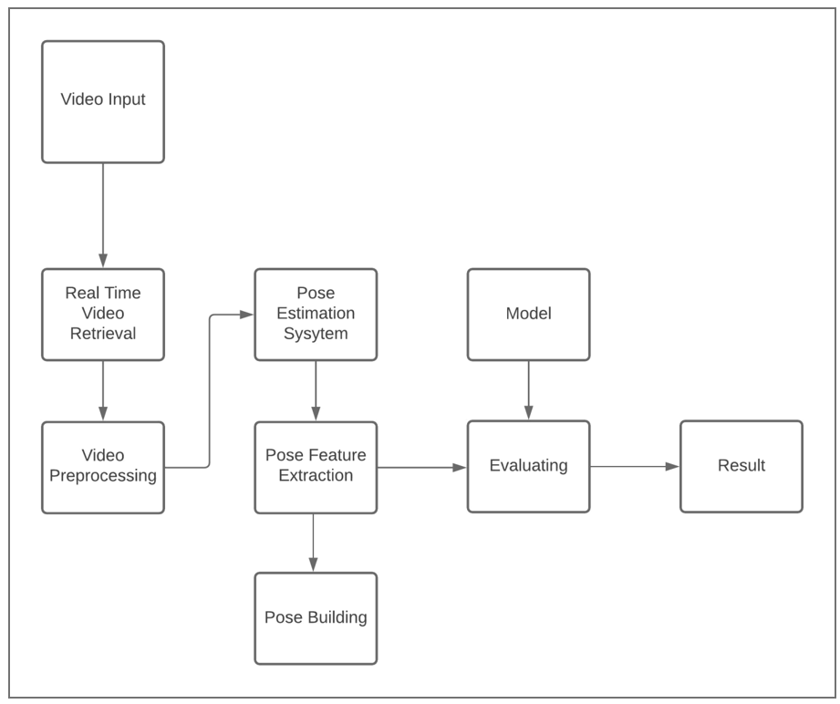
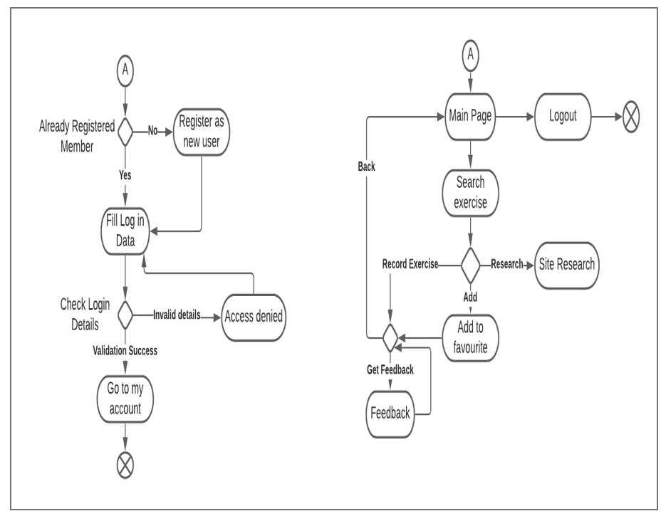
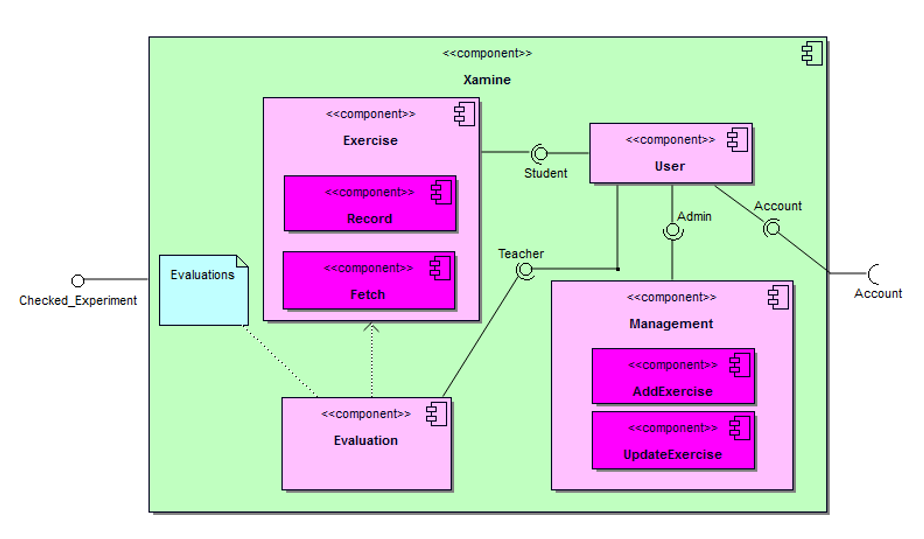
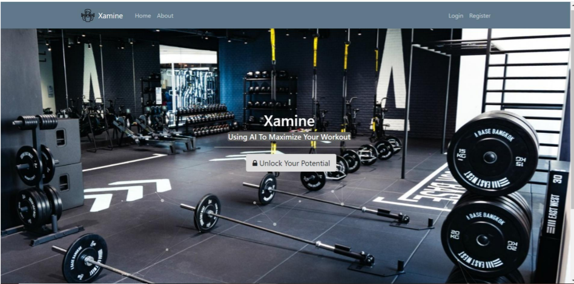
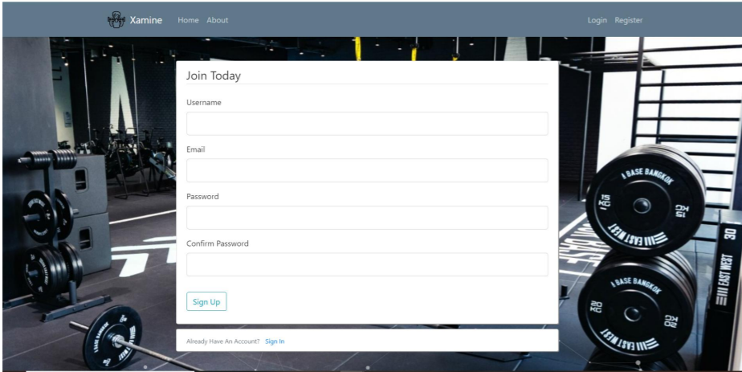
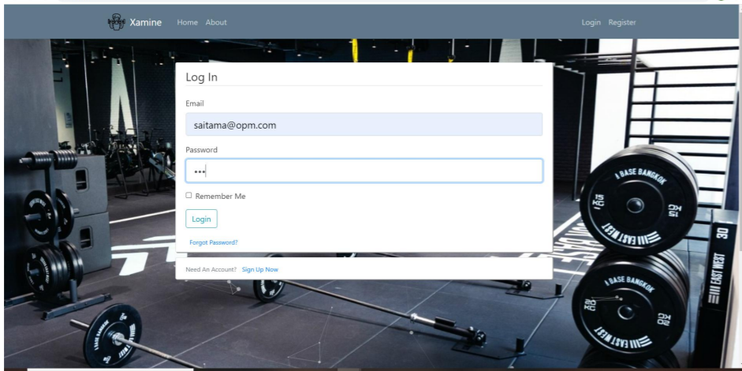
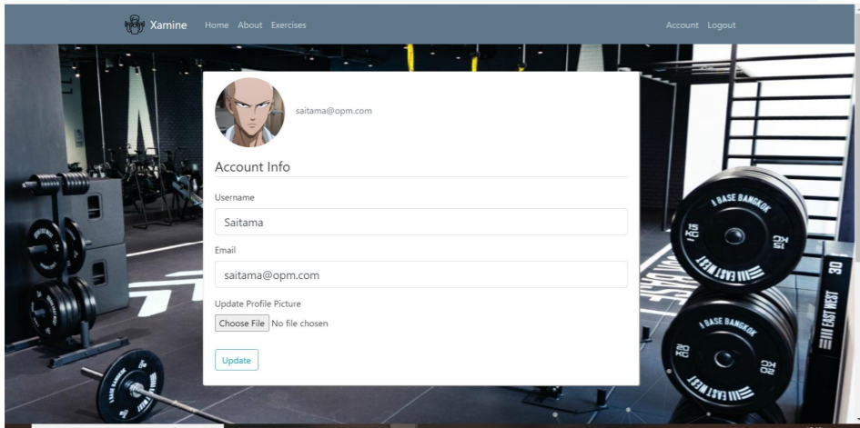
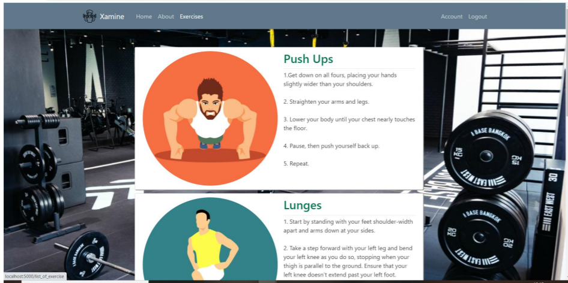
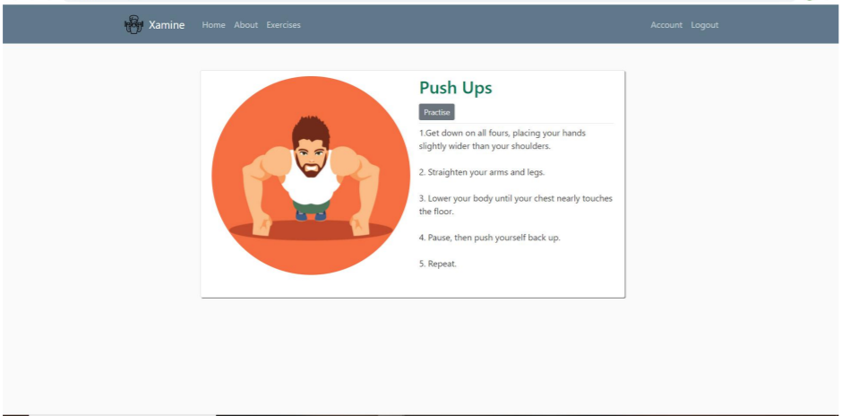

# Xamine
It’s not how much you lift, it’s how well you lift. Doing exercises in the right posture is an important aspect of it. If the posture is incorrect, all the efforts to have a well strengthened physique go in vain. It may even cause injury or have a negative effect on your body. Doing exercises not only makes your body fit but also improves your mental health. Xamine will be a reliable system that will help users to do exercises in the right posture.

Xamine will help the users in home exercises guiding them through the right posture and evaluating their postures if they are correct. It will decrease the need for a physical instructor to instruct the exercise. It will help users to do exercises in the right posture at their convenience. This all will be done using minimum resources and only a camera feed from the user’s device.

With Pose estimation, smart assistance has been built to guide and instruct the users throughout their practice period to attain the correct posture. This helps reduce stress, anxiety, and tension through a series of guided meditative poses. The solution includes human pose estimation using OpenCV framework. Deep Convolutional Neural Network as the architecture, various data collection and processing tasks have been performed.## Application Link

## Application Link
Use the [link](https://xamine-pose.herokuapp.com/predict)

## Scope
With the current pandemic situation, most gyms are closed and people are looking for other ways to stay in shape. The most likely solution is to work out at home through the Fitness app. Plus, memberships to good gyms are quite expensive. The main attraction has always been the personal attention given to the members in the current gymnasium. A personal trainer can correct your posture, talk to you, motivate you, and customize exercises to suit your physical condition. 
With the help of machine learning, these personalized tips can be provided to users. The computer will monitor a person's training to make sure all of their poses and angles are correct. From yoga to lifting weights, the system guides you through every step. It goes beyond your usual training routine and becomes your personal assistant that motivates you to keep practicing.

## Methodology
 Implementation: In this phase, implementation of some of the existing state of the art approaches will be carried out like OpenPose or Convolutional Neural Networks or mediapipe etc. Some of these approaches aim to work on the exercise input and generate keypoints that go right into our model for future purposes. Some also generate time series frames free from any impurity or noise. 

 Modelling: Now comes the step where the processed keypoints are trained to the model that performs the actual task of classification and correction. Design and development of a suitable platform: After the implementation of some of the existing approaches, a GUI based platform will be designed to operate our business logic. 

 Experimental analysis: The experimental analysis will be carried out by testing the developed model in terms of performance evaluation parameters. The analysis and literature survey is a continuous process till the design and implementation phase ; if there is any update related to these approaches, it can be added on.

### Data Collection
In this phase we aim to collect ,prepare and preprocess our dataset which is suitable enough for training the model . From previous analysis made we shall understand the techniques dedicated to give rise to a very appropriate dataset.In our case we may be performing data augmentation – techniques to increase the amount of data by adding slightly modified copies of already existing data.

### Software interface standards
The software package is developed using HTML and CSS, back end is done by Flask and the Deep Learning model is trained using Keras and implemented using TensorFlow. Operating System: Window XP, Windows 7 and higher version Language: HTML, Flask, CSS, HTML, Python Database: SQLite

### Model Training
We have bifurcated our work goals into two streams 
1. Deep Learning Neural Net model 
2. Web Application 
As far as the DNN is concerned we go on continuously processing the images received from the camera feed using OpenCV library and mediapipe Algorithm ( BlazePose Detector and BlazePose GHUM 3D models) that will serve our 2 important agendas of Detection and Estimation respectively. These aim in order to make calculations and predictions to get done all the above requirements. The WebApp is used to display detailed information to a user about a list of exercises. The user can select the desired exercises, practise each pose and finally, check position correctness using the interface which is fed by the DNN models. The solution we came upon was using the technique of generating key-points which further works

###   Novelty of Work 
The proposed solution is quite unique as none of our competitors provide services with the ease that we aim to provide them with. There is no such system at present that can evaluate the real time posture of the person performing some exercise and evaluates it. The alternative present is either the personal trainer or the gym trainer apps that tells users how to perform the exercise but not evaluate it. Our system evaluates the real time posture of the human body and helps them perform exercise to the full potential in the right posture.

###Product Features
Registration : Those who are new to the app are required to register and then login to get benefit of it.
Login in the Web application : For those who have been already registered, can enter their valid e-mail and can benefit from it.
Exercise : The exercise which is desired to be practiced is to be selected.
Practice : This button enables the device camera to detect posture of the human while executing the selected exercise.
Profile : This button enables the user to access personal information & exercise history for the user.

### Application Deployment

Flowchart of application process :-

Short Description 

Video Input and retrieval: The user will use their in-built camera system to input the video to our system. The video will be retrieved and used as input for the evaluation.

Video Preprocessing: The video retrieved will be pre-processed to best suit the pose estimation system.

Pose Estimation system: This will estimate the pose of the user body using video input.

Pose Feature Extraction: The features such as arm joints, Leg joints, etc. will be extracted using a pose estimation system.

Pose Building: The features extracted will be used to make a sketch of the user’s pose on the screen.

Model and Evaluation: It will evaluate the user’s pose based on features extracted and evaluate it according to the trained set.

Result: The user will be given some instructions on what they are doing wrong.

Activity Diagram of application process :-

Component Diagram of application process :-

### Screenshots

User registers for a non existing account.

User then logins in to the created account.

User gets a list of exercises that he/she needs to be practised.

